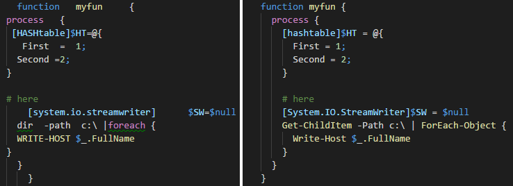
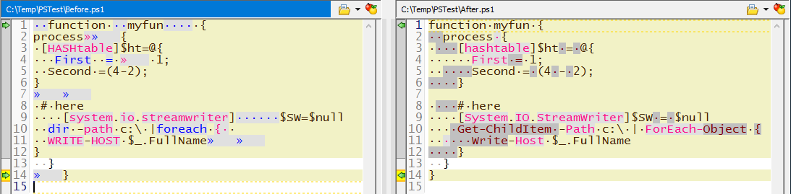
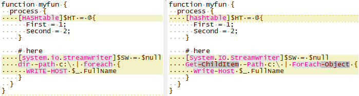

# PowerShell Beautifier

A whitespace reformatter and code cleaner for Windows PowerShell and PowerShell Core (all OSes).

## Formatting Matters

Tabs or spaces; spaces or tabs?  If spaces, how many?  We sure do take whitespace seriously.  But when writing *commit-worthy* PowerShell code, there's more than just whitespace to think about.  Shouldn't you use cmdlet names instead of aliases?  And shouldn't you have correct casing for cmdlets, methods and types?  Especially if you want to support PowerShell Core...?

PowerShell Beautifier is a PowerShell command-line utility for cleaning and reformatting PowerShell script files, written in PowerShell.  Sure, it will change all indentation to tabs or spaces for you - but it will do more than just that.  A picture is worth 1KB words; here's a before/after in VS Code:


Here are the changes in a diff viewer:


Here's another diff viewer showing only alias-replacement and casing changes:



The PowerShell Beautifier makes these changes:
* properly indents code inside {}, [], () and $() groups
* cleans/rearranges all whitespace within a line
* replaces aliases with the command names: ```dir → Get-ChildItem```
* fixes command name casing: ```get-childitem → Get-ChildItem```
* fixes parameter name casing: ```-path → -Path```
* fixes [type] casing
	* changes built-in shortcut / type accelerator: ```[STRING] → [string]```
    *   ```[DSCLocalConfigurationManager] → [DscLocalConfigurationManager]```
	* changes other types if in memory: ```[system.exception] → [System.Exception]```
* ensures file ends with a new line.


### Release Testing
*For each release* the PowerShell Beautifier is tested on:
* Windows PowerShell (v5) (native);
* PowerShell Core - Windows (native);
* Ubuntu 16.04 and CentOS 7 ([official PowerShell Core Docker containers](https://hub.docker.com/r/microsoft/powershell/tags/)).

It is also occasionally tested natively on OSX, Ubuntu 16.04, Windows Server 2016 Core and Nano.


## Table of Contents
* [Setup](#setup)
* [Usage](#usage)
	* [Run on single file updating in place with 2 spaces indentation](#run-on-single-file-updating-in-place-with-2-spaces-indentation)
	* [Run on single file but indent with tabs](#run-on-single-file-but-indent-with-tabs)
	* [Run on single file outputting to new file with 2 spaces indentation](#run-on-single-file-outputting-to-new-file-with-2-spaces-indentation)
	* [Run on multiple files in a directory structure](#run-on-multiple-files-in-a-directory-structure)
    * [Get cleaned content via standard output rather than updating file](#get-cleaned-content-via-standard-output-rather-than-updating-file)
    * [Use LF as newline no matter what the OS](#use-lf-as-newline-no-matter-what-the-os)
* [Want to Know More](#want-to-know-more)
* [Contributing](#contributing)
* [Credits](#credits)
* [License](#license)


## Setup
1. Download the PowerShell Beautifier utility. Clone it, zip it or get it from the PowerShell Gallery:
```
Install-Module -Name PowerShell-Beautifier
```
2. Import the module.  This takes a few seconds the first time but is fast thereafter.
```
Import-Module PowerShell-Beautifier.psd1
```
3. Confirm it is loaded correctly:
```
Get-Help Edit-DTWBeautifyScript

NAME
    Edit-DTWBeautifyScript

SYNOPSIS
    Cleans PowerShell script: re-indents code with spaces or tabs, cleans
    and rearranges all whitespace within a line, replaces aliases with
    cmdlet names, replaces parameter names with proper casing, fixes case for
    [types], etc.


SYNTAX
    Edit-DTWBeautifyScript [-SourcePath] <String> [[-DestinationPath] <String>] [[-IndentType] <String>]
    [-StandardOutput] [[-NewLine] <String>] [<CommonParameters>]
    [<CommonParameters>]

...more text...

```


## Usage

### Before using this utility on any file, back up your file!  
Commit your file, run a backup, run the beautify utility on a copy first, whatever you have to do!  **If you don't use the DestinationPath parameter, it will rewrite your file in place!** I've run this utility on *many* script now but I don't know if something funky in your script might throw off the utility.  Be safe and back it up first!

(FYI, the beautifier *only* rewrites your script at the end of processing if no errors occur.  However better safe than sorry - back it up!)


So, assuming you've imported the module, how do you use it?

### Run on single file updating in place with 2 spaces indentation
This rewrites the source file in place.  Two spaces is the default indent step so IndentType is not specified.
```
Edit-DTWBeautifyScript C:\temp\MyFile.ps1
```

### Run on single file but indent with tabs
This rewrites the source file in place using a tab at the indent step.
```
Edit-DTWBeautifyScript C:\temp\MyFile.ps1 -IndentType Tabs
```

### Run on single file outputting to new file with 2 spaces indentation
This doesn't modify the source file; it outputs the clean version to a new file.  Also uses the default indent step (2 spaces).
```
Edit-DTWBeautifyScript -SourcePath C:\temp\MyFile.ps1 -DestinationPath c:\temp\MyFile_AFTER.ps1
```

### Run on multiple files in a directory structure
Time for the pipeline.
```
Get-ChildItem -Path c:\temp -Include *.ps1,*.psm1 -Recurse | Edit-DTWBeautifyScript
```

Note: if you don't include the file extension filtering you'll need some other way to ignore folders (i.e. ignore PSIsContainer -eq $true) as Edit-DTWBeautifyScript will error for those.

### Get cleaned content via standard output rather than updating file
If you want to receive the beautified content via stdout (most likely if you are calling from an external editor), use the -StandardOutput (or -StdOut) parameter:
```
Edit-DTWBeautifyScript C:\temp\MyFile.ps1 -StandardOutput
```

When using -StandardOutput, the SourcePath is used for content but not updated, DestinationPath is ignored (if passed).  If an error occurs (syntax error in user script), no content is returned via stdout but stderr will have a concise error that can be displayed to the user.

### Use LF as newline no matter what the OS
By default, when writing the file the beautifier will use the host OS's style for newlines.  To override this, use -NewLine and pass either CRLF or LF.

For example, to force newline endings to be LF
```
Edit-DTWBeautifyScript C:\temp\MyFile.ps1 -NewLine LF
```


## Want to Know More
* [FAQ](docs/FAQ.md)
* [How it works](docs/HowItWorks.md)
* [How to test and add test cases](docs/Testing.md)
* [How to automate testing the Beautifier and your scripts across OSes using Docker](test/Automation/README.md)
* [Help add support for text editors](docs/ExternalEditors.md) like Atom and others
* [Project roadmap](docs/Roadmap.md) - enhancements, external editors, BOM/encoding functions and more
* [Change log](docs/ChangeLog.md)


## Contributing
There are several ways to contribute: 
* [test it and identify what works and what could be better](docs/Testing.md);
* help with [adding support for text editors](docs/ExternalEditors.md);
* and maybe even contribute code changes!


## Credits
Dan Ward created the PowerShell Beautifier as a pet project back in 2011 but only recently added it to Github.


## License
The PowerShell Beautifier is licensed under the [MIT license](LICENSE).
